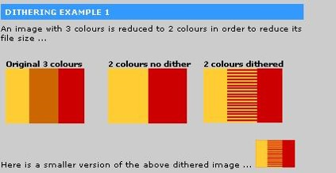
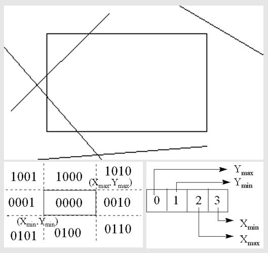

# ICG note

## Basic

### Dithering (抖動著色)

- (using 2^8 colors to approximate 2^16 colors)
- halftone approximation: 網點著色
- also called clustered-dot Ordered dither



### Error Diffusion Dithering

把錯誤往右下擴散，一種平均錯誤的概念

```
error        (0,0) diffusion    (0,1) diffusion
[1  1  1]    [    1  1+3/8 1]    [    1  1+3/8              1+(11/8)*(3/8)]
[1 -1  1] -> [1+3/8 -1+2/8 1] -> [1+3/8 -1+2/8+(11/8)*(3/8) 1+(11/8)*(2/8)]
[1 -1  1]    [    1     -1 1]    [    1                  -1              1]
```

### Clipping Line



- **[reject line]** If logical AND of the codes of the endpoints is not zero
- **[new line segment]** Replacement by intersection point
