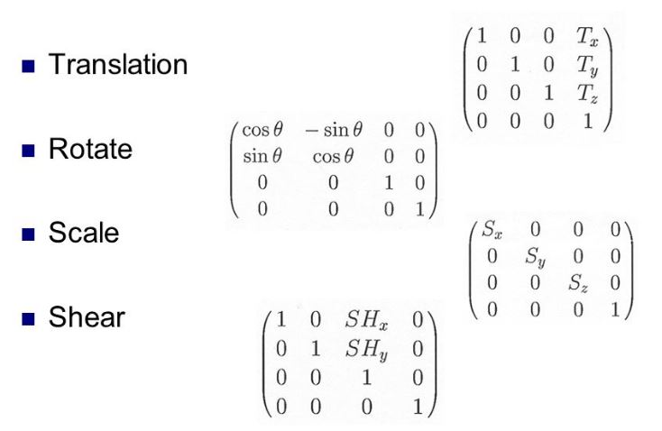
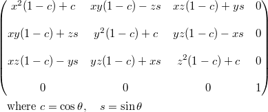

# Basic

## Dithering (抖動著色)

- (using 2^8 colors to approximate 2^16 colors)
- halftone approximation: 網點著色
- also called clustered-dot Ordered dither


## Error Diffusion Dithering

把錯誤往右下擴散，一種平均錯誤的概念

```
original     (0,0) err = 1       (0,1) err = 11/8
[7 7 5]    [     6  7+3/8 *]    [     6                   6  1+(11/8)*(3/8)]
[3 1 3] -> [ 3+2/8  1+2/8 *] -> [ 3+3/8  1+2/8+(11/8)*(3/8)               *]
[5 8 7]    [     *      * *]    [     *                   *               *]
```

## Clipping Line


- **[reject line]** If logical AND of the codes of the endpoints is not zero
- **[new line segment]** Replacement by intersection point

## Tranformation


