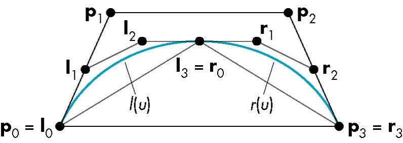

# Curve & Surface

## Bezier Curve


[Bezier curve DEMO](http://math.hws.edu/eck/cs424/notes2013/canvas/bezier.html)

## Subdividing Bezier curve



```py
middle = 1/2*(p1 + p2)

i0 = p0
i1 = (p0 + p1)/2
i2 = (i1 + middle)/2

r3 = p3
r2 = (p2 + p3)/2
r1 = (r2 + middle)/2

i3 = r0 = (i2 + r1)/2
```

## Parametric bicubic surfaces


## B-spline

- Both Bezier and B-Spline curves are used for drawing and evaluating smooth curves, especially in computer graphics and animations.
- B-Spline offer more control and flexibility than Bezier curves