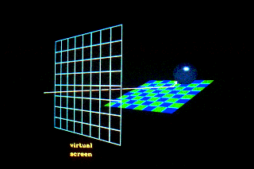
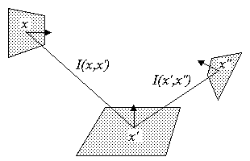
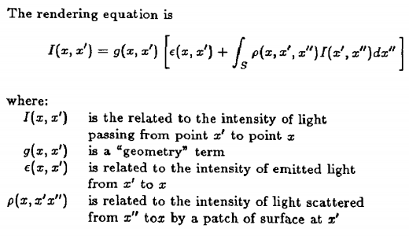

# Ray tracing

## For each pixel in film:

1. 從成像平面的像素射 ray
2. 尋找與場景中物件的交點
3. 產生**反射**、**折射**等新 ray，繼續追蹤這些新 ray(遞迴 2, 3 直到與光源相交)
4. 計算這個像素的顏色

## Shadow ray

>If the ray hits an object, we want to know if that point on the object is in a shadow. So, when the ray hits an object, a secondary ray, called a "shadow" ray, is shot towards the light sources.  
If this shadow ray hits another object before it hits a light source, then the first intersection point is in the shadow of the second object.

# Rendering Equation

`I(x, x')` 表示從 x' 到 x 的光強  
`g(x, x')` 表示從 x' 到 x 中間是否有物體，若有則值為 0，若沒有則值為 1；假如該物體半透明，則值介於 [0, 1]  
`e(x, x')` 表示 x' 自身發光到 x 的光強  
`p(x, x', x")` 表示從 x" 到 x' 再到 x 的反射係數  