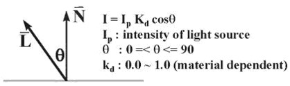
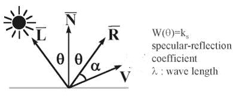

## Shading

### Illumination model

- Ambient

    I = la * ka * objectColor  
    la: Intensity of ambient light  
    ka: 0.0 ~ 1.0
  
- Diffuse

    I = lightColor * Kd * objectColor * cosθ  
    

- Specular

    I = Ks * lightColor * cos^n(α)  
    Ks = specular-reflection coef.  
    

### Polygon Shading

- Flat shading: 整個三角形都一樣的顏色
- Gouraud shading: 算出頂點顏色，三角形內部顏色用雙線性內插
- Phong shading: 三角形內部法向量用雙線性內插，再去算所有點顏色

