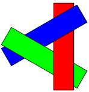
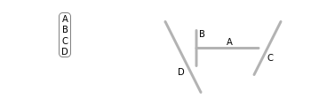
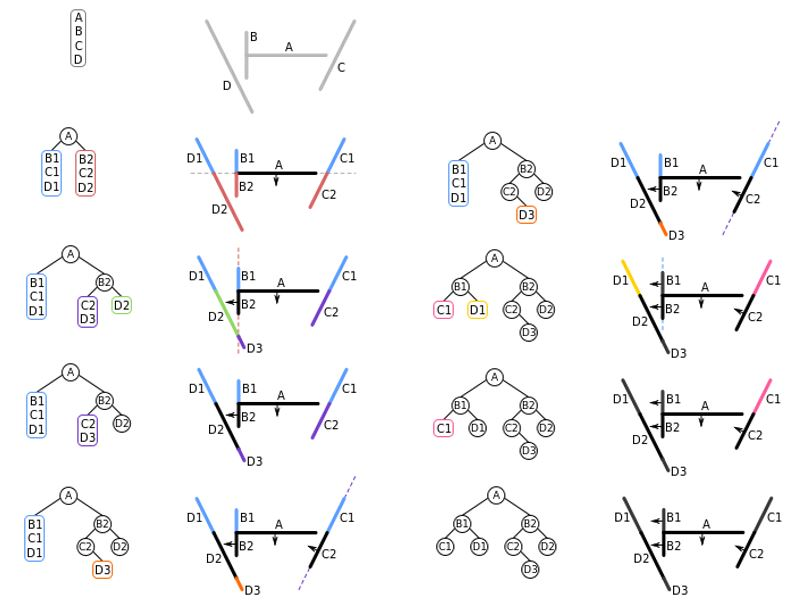
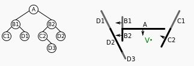

## Visible-surface determination

### Painter

```py
objects = objects.sort() # far to near
for obj in objects:
    paint_on_screen(obj)
```

- 近的因為比較晚畫，所以會覆蓋掉遠的。
- 某些例子會失敗，如: 互相覆蓋的物件

    


### Z-buffer

```py
z_buffer[x][y] = INFINITY
color[x][y] = 0

for polygon in polygon_list:
    for (x, y) in polygon:
        if depth_P(x, y) < z-buffer[x][y]:
            z-buffer[x][y] = depth_P(x, y)
            color[x][y] = color_of_P(x, y)
```

- 維護一個跟螢幕一樣大的 z-buffer array，紀錄每個 pixel 的 Z 值以及其顏色
- 簡單，可以藉由硬體幫助讓此演算法超快

### Binary Space Partition

#### Build the BSP tree

左子樹是 Back, 右子樹是 Front  




#### Traversal

```py
def BSP_displayTree(root):
    if Viewer is in_front_of root:
        # Begin {display back child, root, and front child}
        BSP_displayTree(root.backchild)
        displayPolygon(root)
        BSP_displayTree(root.frontchild)
    else:
        BSP_displayTree(root.frontchild)
        displayPolygon(root)
        BSP_displayTree(root.backchild)
```



```py
# [1-st] V in front of A
BSP_displayTree(B1) # back tree
displayPolygon(A)   # root node
BSP_displayTree(B2) # front tree

# [2-nd] V not in front of B1
BSP_displayTree(D1) # front tree
displayPolygon(B1)  # root node
BSP_displayTree(C1) # back tree

# [3-rd] keep recursive...
```
---
