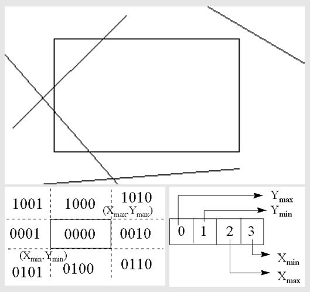
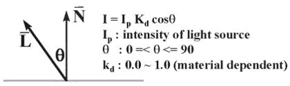

# ICG note

## Basic

### Dithering (抖動著色)

- (using 2^8 colors to approximate 2^16 colors)
- halftone approximation: 網點著色
- also called clustered-dot Ordered dither


### Error Diffusion Dithering

把錯誤往右下擴散，一種平均錯誤的概念

```
error        (0,0) diffusion    (0,1) diffusion
[1  1  1]    [    1  1+3/8 1]    [    1  1+3/8              1+(11/8)*(3/8)]
[1 -1  1] -> [1+3/8 -1+2/8 1] -> [1+3/8 -1+2/8+(11/8)*(3/8) 1+(11/8)*(2/8)]
[1 -1  1]    [    1     -1 1]    [    1                  -1              1]
```

### Clipping Line



- **[reject line]** If logical AND of the codes of the endpoints is not zero
- **[new line segment]** Replacement by intersection point


---

## Shading

### Illumination model

- Ambient

    I = la * ka * objectColor  
    la: Intensity of ambient light  
    ka: 0.0 ~ 1.0
  
- Diffuse

    I = lightColor * Kd * objectColor * cosθ  
    

- Specular

    I = Ks * lightColor * cos^n(α)  
    Ks = specular-reflection coef.  
    

### Polygon Shading

- Flat shading: 整個三角形都一樣的顏色
- Gouraud shading: 算出頂點顏色，三角形內部顏色用雙線性內插
- Phong shading: 三角形內部法向量用雙線性內插，再去算所有點顏色


---

## Visible-surface determination

### Painter

```py
objects = objects.sort() # far to near
for obj in objects:
    paint_on_screen(obj)
```

- 近的因為比較晚畫，所以會覆蓋掉遠的。
- 某些例子會失敗，如: 互相覆蓋的物件

    


### Z-buffer

```py
z_buffer[x][y] = INFINITY
color[x][y] = 0

for polygon in polygon_list:
    for (x, y) in polygon:
        if depth_P(x, y) < z-buffer[x][y]:
            z-buffer[x][y] = depth_P(x, y)
            color[x][y] = color_of_P(x, y)
```

- 維護一個跟螢幕一樣大的 z-buffer array，紀錄每個 pixel 的 Z 值以及其顏色
- 簡單，可以藉由硬體幫助讓此演算法超快

### Binary Space Partition

#### Build the BSP tree

左子樹是 Back, 右子樹是 Front  


#### Traversal

```py
def BSP_displayTree(root):
    if Viewer is in_front_of root:
        # Begin {display back child, root, and front child}
        BSP_displayTree(root.backchild)
        displayPolygon(root)
        BSP_displayTree(root.frontchild)
    else:
        BSP_displayTree(root.frontchild)
        displayPolygon(root)
        BSP_displayTree(root.backchild)
```


```py
# [1-st] V in front of A
BSP_displayTree(B1) # back tree
displayPolygon(A)   # root node
BSP_displayTree(B2) # front tree

# [2-nd] V not in front of B1
BSP_displayTree(D1) # front tree
displayPolygon(B1)  # root node
BSP_displayTree(C1) # back tree

# [3-rd] keep recursive...
```
---

## Ray tracing

### For each pixel in film:

1. 從成像平面的像素射 ray
2. 尋找與場景中物件的交點
3. 產生**反射**、**折射**等新 ray，繼續追蹤這些新 ray(遞迴 2, 3 直到與光源相交)
4. 計算這個像素的顏色


---

## Rendering equation

---

## Curve & Surface

### Bezier Curve

- [DEMO](http://math.hws.edu/eck/cs424/notes2013/canvas/bezier.html)
- Use subdividing to approximate real curve

  

### Parametric bicubic surfaces

