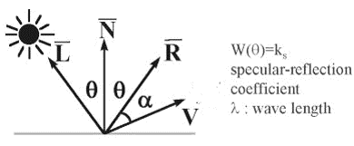
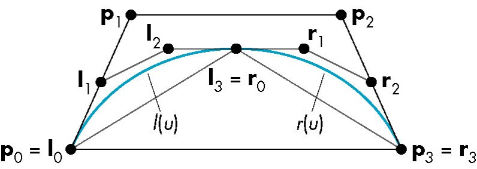
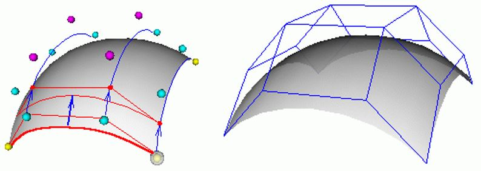

# ICG note

## Basic

### Dithering (抖動著色)

- (using 2^8 colors to approximate 2^16 colors)
- halftone approximation: 網點著色
- also called clustered-dot Ordered dither


### Error Diffusion Dithering

把錯誤往右下擴散，一種平均錯誤的概念

```
error        (0,0) diffusion    (0,1) diffusion
[1  1  1]    [    1  1+3/8 1]    [    1  1+3/8              1+(11/8)*(3/8)]
[1 -1  1] -> [1+3/8 -1+2/8 1] -> [1+3/8 -1+2/8+(11/8)*(3/8) 1+(11/8)*(2/8)]
[1 -1  1]    [    1     -1 1]    [    1                  -1              1]
```

### Clipping Line


- **[reject line]** If logical AND of the codes of the endpoints is not zero
- **[new line segment]** Replacement by intersection point


---

## Shading

### Illumination model

- Ambient

    I = la * ka * objectColor  
    la: Intensity of ambient light  
    ka: 0.0 ~ 1.0
  
- Diffuse

    I = lightColor * Kd * objectColor * cosθ  
    

- Specular

    I = Ks * lightColor * cos^n(α)  
    Ks = specular-reflection coef.  
    

### Polygon Shading

- Flat shading: 整個三角形都一樣的顏色
- Gouraud shading: 算出頂點顏色，三角形內部顏色用雙線性內插
- Phong shading: 三角形內部法向量用雙線性內插，再去算所有點顏色


---

## Visible-surface determination

### Painter

### Z-buffer

```py
z_buffer[x][y] = INFINITY
color[x][y] = 0

for polygon in polygon_list:
    for (x, y) in polygon:
        if depth_P(x, y) < z-buffer[x][y]:
            z-buffer[x][y] = depth_P(x, y)
            color[x][y] = color_of_P(x, y)
```

### List-priority

### Binary Space Partition

```py
def BSP_displayTree(root):
    if Viewer is in front of root:
        # Begin {display back child, root, and front child}
        BSP_displayTree(root.backchild)
        displayPolygon(root)
        BSP_displayTree(root.frontchild)
    else:
        BSP_displayTree(root.frontchild)
        displayPolygon(root)
        BSP_displayTree(root.backchild)
```

---

## Ray tracing

---

## Rendering equation

---

## Curve & Surface

### Bezier Curve

- [DEMO](http://math.hws.edu/eck/cs424/notes2013/canvas/bezier.html)
- Use subdividing to approximate real curve

  

### Parametric bicubic surfaces

